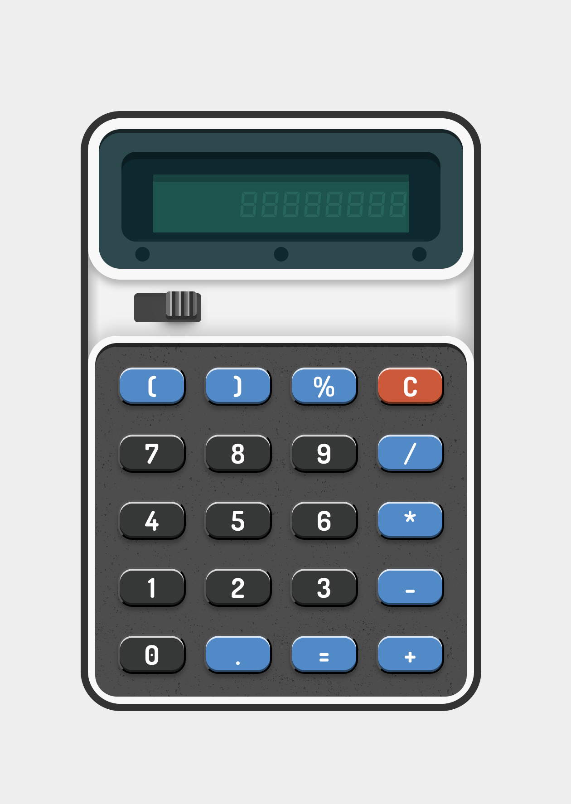

# React Calculator

A classic, old-school calculator built with React, TypeScript, CSS Modules, and Vite (using SWC for fast builds). This project demonstrates fundamental React concepts with a focus on clean code, component-based architecture, and responsive design.



---

## Features

- Basic arithmetic operations: addition, subtraction, multiplication, division
- Responsive layout that works well on desktop and mobile devices
- Built with TypeScript for type safety
- Styled using CSS Modules for scoped and maintainable styles
- Powered by Vite with SWC for fast development and build times

---

## Getting Started

### Prerequisites

- Node.js (v16 or later recommended)
- npm or yarn

### Installation

1. Clone the repository:

   ```bash
   git clone https://github.com/strikks001/calculator-react.git
   cd calculator-react
   ```

2. Install dependencies:

   ```bash
   npm install
   ```

3. Start the development server:

   ```bash
   npm run dev
   ```

4. Open your browser and navigate to `http://localhost:5173` (or the port shown in your terminal)

---

## Build

To build the app for production:

```bash
npm run build
# or
yarn build
```

The output will be in the `dist` folder.

---

## Project Structure

- `src/` - Main source folder
  - `components/` - React components
  - `Calculator.tsx` - Root app component
  - `main.tsx` - Entry point
- `public/` - Static assets
- `vite.config.ts` - Vite configuration file

---

## License

This project is licensed under the MIT License.

---

## Author

Sanne Strikkers  
[GitHub Profile](https://github.com/strikks001)

---

Feel free to reach out if you want to contribute or report any issues!
